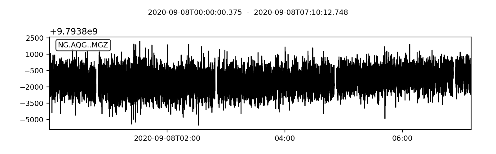

# Script to generate mSEED from AQG .csv file

Modify the input file in the `convert.py` script. An example AQG input file is given: `capture_20200826_170834_raw_13.csv` written to `NG.AQG..MGZ.D.2020.252`.

## Specifics

The sampling rate of the AQG appears to be 0.54s. The ObsPy library is used to write mSEED files. Data is split in to continuous segments (a full trace without gaps). Each gap (with some tolerance due to irregular sampling of the AQG) introduces a new data segment with a new start time. The traces are bundled in a stream and written to a mSEED file.

## Naming

The mSEED standard has four identifiers (ASCII, N bytes): network (2), station (5), location (2), and channel (3). The network is defined here as `NG`, the station as `AQG`, the location is an empty string and will change when the AQG is moved. The channel is defined following the mSEED standard (M) because of the 2Hz sampling rate, (G) for gravimeter, and (Z) for the z-component. In total the identifier is `NG.AQG..MGZ`.

## Example

    >>> from obspy import read
    >>> st = read("NG.AQG..MGZ.D.2020.252")
    >>> print(st)

    5 Trace(s) in Stream:
    NG.AQG..MGZ | 2020-09-08T00:00:00.375000Z - 2020-09-08T00:47:17.535000Z | 1.9 Hz, 5255 samples
    NG.AQG..MGZ | 2020-09-08T00:49:29.274000Z - 2020-09-08T02:48:51.294000Z | 1.9 Hz, 13264 samples
    NG.AQG..MGZ | 2020-09-08T02:51:02.466000Z - 2020-09-08T04:50:24.486000Z | 1.9 Hz, 13264 samples
    NG.AQG..MGZ | 2020-09-08T04:52:35.656000Z - 2020-09-08T06:51:57.136000Z | 1.9 Hz, 13263 samples
    NG.AQG..MGZ | 2020-09-08T06:54:09.388000Z - 2020-09-08T07:10:12.748000Z | 1.9 Hz, 1785 samples

